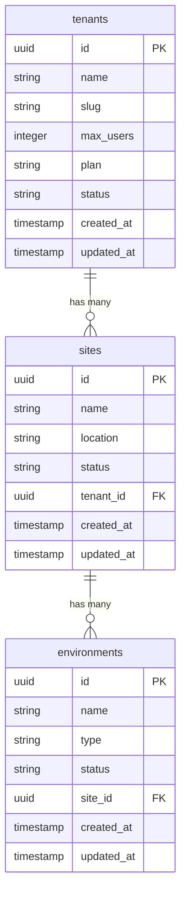

# Design Document

## Overview

The Admin Organization Management feature provides a comprehensive interface for system administrators to manage the complete organizational hierarchy: Organizations → Sites → Environments. This design builds upon the existing admin infrastructure and follows established patterns for API design, authentication, and UI components.

The solution consists of three main components:
1. **API Layer**: RESTful endpoints for managing sites and environments within organizations
2. **Management Interface**: A unified page for viewing and editing organizational hierarchies
3. **Navigation Enhancement**: Improved organization list with direct access to management features

## Architecture

### System Architecture

```mermaid
graph TB
    subgraph "Frontend Layer"
        OrgList[Organizations List Page]
        OrgManage[Organization Management Page]
        SiteModal[Create Site Modal]
        EnvModal[Create Environment Modal]
    end
    
    subgraph "API Layer"
        OrgSitesAPI[/api/admin/organizations/[id]/sites]
        SiteEnvsAPI[/api/admin/sites/[id]/environments]
        ExistingOrgAPI[/api/admin/organizations/[id]]
    end
    
    subgraph "Database Layer"
        Tenants[(tenants)]
        Sites[(sites)]
        Environments[(environments)]
    end
    
    OrgList --> OrgManage
    OrgManage --> OrgSitesAPI
    OrgManage --> SiteEnvsAPI
    OrgManage --> ExistingOrgAPI
    
    SiteModal --> OrgSitesAPI
    EnvModal --> SiteEnvsAPI
    
    OrgSitesAPI --> Tenants
    OrgSitesAPI --> Sites
    SiteEnvsAPI --> Sites
    SiteEnvsAPI --> Environments
```

### Data Flow

1. **Organization Selection**: Admin clicks organization card → Navigate to management page
2. **Site Management**: Management page loads organization data and associated sites
3. **Environment Management**: Sites can be expanded to show environments, with creation capabilities
4. **Real-time Updates**: All operations update the UI immediately using SWR for data fetching

## Components and Interfaces

### API Endpoints

#### 1. Organization Sites API (`/api/admin/organizations/[id]/sites`)

**GET** - Retrieve all sites for an organization
```typescript
interface SitesResponse {
  sites: Site[]
  total: number
}

interface Site {
  id: string
  name: string
  location: string
  status: 'active' | 'suspended' | 'cancelled'
  created_at: string
  updated_at: string
  tenant_id: string
}
```

**POST** - Create a new site for an organization
```typescript
interface CreateSiteRequest {
  name: string
  location: string
  status?: 'active' | 'suspended' | 'cancelled'
}

interface CreateSiteResponse {
  site: Site
  message: string
}
```

#### 2. Site Environments API (`/api/admin/sites/[id]/environments`)

**GET** - Retrieve all environments for a site
```typescript
interface EnvironmentsResponse {
  environments: Environment[]
  total: number
}

interface Environment {
  id: string
  name: string
  type: 'indoor' | 'outdoor' | 'warehouse' | 'office' | 'production'
  status: 'active' | 'suspended' | 'cancelled'
  created_at: string
  updated_at: string
  site_id: string
}
```

**POST** - Create a new environment for a site
```typescript
interface CreateEnvironmentRequest {
  name: string
  type: 'indoor' | 'outdoor' | 'warehouse' | 'office' | 'production'
  status?: 'active' | 'suspended' | 'cancelled'
}

interface CreateEnvironmentResponse {
  environment: Environment
  message: string
}
```

### UI Components

#### 1. Organization Management Page (`/admin/organizations/[id]/manage`)

**Features:**
- Organization overview with key metrics
- Hierarchical site and environment display
- Expandable/collapsible site sections
- Modal forms for creating sites and environments
- Breadcrumb navigation
- Status indicators and action buttons

**State Management:**
```typescript
interface ManagementPageState {
  organization: Organization | null
  sites: Site[]
  expandedSites: Set<string>
  showCreateSiteModal: boolean
  showCreateEnvironmentModal: boolean
  selectedSiteId: string | null
}
```

#### 2. Create Site Modal

**Features:**
- Form validation for required fields
- Status selection dropdown
- Error handling and display
- Success feedback

#### 3. Create Environment Modal

**Features:**
- Environment type selection
- Form validation
- Integration with parent site context
- Error handling

#### 4. Enhanced Organization List

**Features:**
- Clickable organization cards
- Direct "Manage" buttons
- Improved hover states
- Navigation to management page

## Data Models

### Database Schema Relationships



### Validation Rules

#### Site Validation
- **name**: Required, 1-100 characters
- **location**: Required, 1-200 characters  
- **status**: Optional, enum ['active', 'suspended', 'cancelled'], default 'active'
- **tenant_id**: Required, must reference existing organization

#### Environment Validation
- **name**: Required, 1-100 characters
- **type**: Required, enum ['indoor', 'outdoor', 'warehouse', 'office', 'production']
- **status**: Optional, enum ['active', 'suspended', 'cancelled'], default 'active'
- **site_id**: Required, must reference existing site

## Error Handling

### API Error Responses

All API endpoints follow the established error response format:

```typescript
interface ErrorResponse {
  error: {
    code: string
    message: string
    requestId: string
  }
}
```

### Error Scenarios

1. **Authentication Errors** (401)
   - Missing or invalid authentication
   - Response: `{ code: 'AUTHENTICATION_REQUIRED', message: 'Authentication required' }`

2. **Authorization Errors** (403)
   - Non-admin user access
   - Response: `{ code: 'ADMIN_ACCESS_REQUIRED', message: 'Admin access required' }`

3. **Validation Errors** (400)
   - Missing required fields
   - Invalid enum values
   - Response: `{ code: 'VALIDATION_ERROR', message: 'Specific validation message' }`

4. **Not Found Errors** (404)
   - Organization not found
   - Site not found
   - Response: `{ code: 'NOT_FOUND', message: 'Resource not found' }`

5. **Server Errors** (500)
   - Database connection issues
   - Unexpected server errors
   - Response: `{ code: 'INTERNAL_ERROR', message: 'Internal server error' }`

### Frontend Error Handling

- **Form Validation**: Real-time validation with inline error messages
- **API Errors**: Toast notifications or modal error displays
- **Network Errors**: Retry mechanisms and offline indicators
- **Loading States**: Skeleton screens and loading spinners

## Testing Strategy

### API Testing

#### Unit Tests
- Input validation for all endpoints
- Authentication and authorization checks
- Database operation success/failure scenarios
- Error response formatting

#### Integration Tests
- End-to-end API workflows
- Database transaction integrity
- Cross-resource relationship validation

### Frontend Testing

#### Component Tests
- Modal form submissions
- State management (expand/collapse, form states)
- Error display and handling
- Navigation behavior

#### User Interface Tests
- Organization card click navigation
- Site and environment creation workflows
- Responsive design validation
- Accessibility compliance

### Test Data Requirements

```typescript
// Test Organizations
const testOrganizations = [
  { id: 'org-1', name: 'Test Corp', slug: 'test-corp', status: 'active' },
  { id: 'org-2', name: 'Demo Inc', slug: 'demo-inc', status: 'suspended' }
]

// Test Sites
const testSites = [
  { id: 'site-1', name: 'Main Office', location: 'New York', tenant_id: 'org-1' },
  { id: 'site-2', name: 'Warehouse', location: 'Chicago', tenant_id: 'org-1' }
]

// Test Environments
const testEnvironments = [
  { id: 'env-1', name: 'Production Floor', type: 'production', site_id: 'site-1' },
  { id: 'env-2', name: 'Storage Area', type: 'warehouse', site_id: 'site-2' }
]
```

## Security Considerations

### Authentication & Authorization
- All endpoints require admin role verification
- JWT token validation on every request
- Role-based access control (RBAC) enforcement

### Data Validation
- Server-side validation for all inputs
- SQL injection prevention through parameterized queries
- XSS prevention through input sanitization

### Audit Logging
- All create/update/delete operations logged to `admin_activity` table
- Include admin ID, action type, resource details, and timestamps
- Maintain audit trail for compliance and debugging

## Performance Considerations

### Database Optimization
- Proper indexing on foreign key relationships
- Efficient queries with appropriate SELECT clauses
- Connection pooling for concurrent requests

### Frontend Optimization
- SWR for intelligent data fetching and caching
- Lazy loading for environment data
- Optimistic updates for better user experience

### Scalability
- Pagination support for large datasets (future enhancement)
- Efficient data structures for hierarchical displays
- Minimal re-renders through proper state management