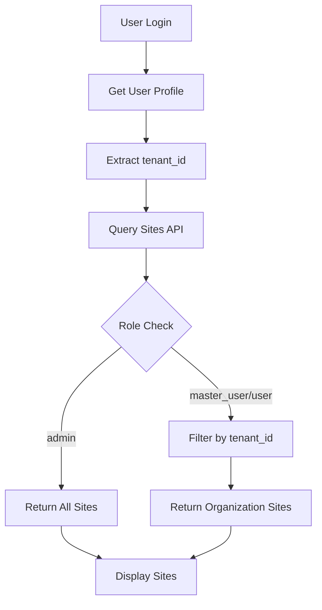
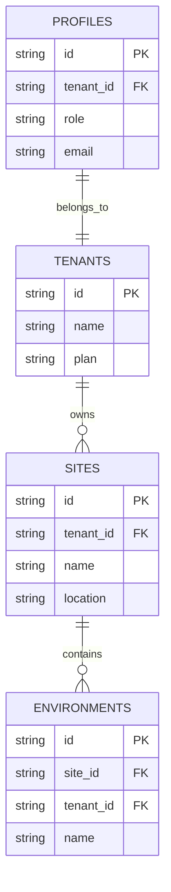

# Organization User Site Access - Design Document

## Overview

This design implements automatic site access for organization users based on their tenant membership. The system leverages the existing `tenant_id` field in user profiles to automatically grant access to all sites belonging to the user's organization, eliminating the need for individual site assignments.

## Architecture

### Current System Context

The existing system uses:
- `profiles.tenant_id` to associate users with organizations (tenants)
- `sites.tenant_id` to associate sites with organizations
- Role-based access control with `admin`, `master_user`, and `user` roles
- RLS (Row Level Security) policies for data access control

### Access Control Flow



### Data Relationships



## Components and Interfaces

### 1. Authentication Layer Updates

**File: `src/utils/auth.ts`**

Update the `canAccessSite` function to implement organization-based access:

```typescript
export function canAccessSite(profile: UserProfile, siteId: string): boolean {
  // Admin can access any site
  if (profile.role === "admin") {
    return true;
  }

  // Master users and regular users can access sites in their organization
  if (profile.role === "master_user" || profile.role === "user") {
    // Access will be validated at the API level using tenant_id matching
    return profile.tenant_id !== null;
  }

  return false;
}
```

Add new helper function for organization-based filtering:

```typescript
export function getOrganizationSiteFilter(profile: UserProfile) {
  if (profile.role === "admin") {
    return null; // No filter - can see all sites
  }
  
  if (profile.tenant_id) {
    return { tenant_id: profile.tenant_id };
  }
  
  return { tenant_id: "no-access" }; // Ensures no sites are returned
}
```

### 2. API Layer Implementation

**File: `src/app/api/sites/route.ts`**

Create a new user-facing sites API endpoint:

```typescript
export async function GET(request: NextRequest) {
  const authContext = await getAuthContext(request);
  
  if (!authContext) {
    return NextResponse.json(createAuthError('Authentication required'), { status: 401 });
  }

  const supabase = await createServerSupabaseClient();
  const filter = getOrganizationSiteFilter(authContext.profile);
  
  let query = supabase
    .from('sites')
    .select(`
      id,
      name,
      location,
      description,
      status,
      created_at,
      tenant_id,
      tenant:tenants!sites_tenant_id_fkey(
        id,
        name,
        plan
      )
    `)
    .order('created_at', { ascending: false });

  // Apply organization filter for non-admin users
  if (filter) {
    query = query.eq('tenant_id', filter.tenant_id);
  }

  const { data: sites, error } = await query;
  
  // Include environment counts
  const sitesWithCounts = await Promise.all(
    (sites || []).map(async (site) => {
      const { count } = await supabase
        .from('environments')
        .select('id', { count: 'exact' })
        .eq('site_id', site.id);

      return {
        ...site,
        environment_count: count || 0
      };
    })
  );

  return NextResponse.json({
    sites: sitesWithCounts,
    total: sitesWithCounts.length
  });
}
```

### 3. Environment Access API

**File: `src/app/api/sites/[siteId]/environments/route.ts`**

```typescript
export async function GET(request: NextRequest, { params }: { params: { siteId: string } }) {
  const authContext = await getAuthContext(request);
  
  if (!authContext) {
    return NextResponse.json(createAuthError('Authentication required'), { status: 401 });
  }

  const supabase = await createServerSupabaseClient();
  
  // First verify user can access this site
  const { data: site } = await supabase
    .from('sites')
    .select('id, tenant_id')
    .eq('id', params.siteId)
    .single();

  if (!site) {
    return NextResponse.json(createAuthError('Site not found'), { status: 404 });
  }

  // Check organization access
  if (authContext.profile.role !== 'admin' && site.tenant_id !== authContext.profile.tenant_id) {
    return NextResponse.json(createAuthError('Access denied'), { status: 403 });
  }

  // Get environments for the site
  const { data: environments, error } = await supabase
    .from('environments')
    .select(`
      id,
      name,
      environment_type,
      status,
      created_at,
      site_id
    `)
    .eq('site_id', params.siteId)
    .order('created_at', { ascending: false });

  return NextResponse.json({
    environments: environments || [],
    total: environments?.length || 0
  });
}
```

### 4. Frontend Components

**File: `src/components/SitesList.tsx`**

```typescript
'use client';

import { useEffect, useState } from 'react';
import { useAuthStore } from '@/stores/authStore';

interface Site {
  id: string;
  name: string;
  location: string;
  status: string;
  environment_count: number;
  tenant: {
    name: string;
  };
}

export default function SitesList() {
  const [sites, setSites] = useState<Site[]>([]);
  const [loading, setLoading] = useState(true);
  const { profile } = useAuthStore();

  useEffect(() => {
    async function fetchSites() {
      try {
        const response = await fetch('/api/sites');
        if (response.ok) {
          const data = await response.json();
          setSites(data.sites);
        }
      } catch (error) {
        console.error('Failed to fetch sites:', error);
      } finally {
        setLoading(false);
      }
    }

    if (profile) {
      fetchSites();
    }
  }, [profile]);

  if (loading) {
    return <div>Loading sites...</div>;
  }

  if (sites.length === 0) {
    return (
      <div className="text-center py-8">
        <p>No sites available for your organization.</p>
        {profile?.role === 'master_user' && (
          <p className="text-sm text-gray-600 mt-2">
            Contact your administrator to add sites to your organization.
          </p>
        )}
      </div>
    );
  }

  return (
    <div className="grid gap-4">
      {sites.map((site) => (
        <div key={site.id} className="border rounded-lg p-4">
          <div className="flex justify-between items-start">
            <div>
              <h3 className="font-semibold">{site.name}</h3>
              <p className="text-gray-600">{site.location}</p>
              <p className="text-sm text-gray-500">
                Organization: {site.tenant.name}
              </p>
            </div>
            <div className="text-right">
              <span className={`px-2 py-1 rounded text-sm ${
                site.status === 'active' ? 'bg-green-100 text-green-800' : 'bg-gray-100 text-gray-800'
              }`}>
                {site.status}
              </span>
              <p className="text-sm text-gray-600 mt-1">
                {site.environment_count} environments
              </p>
            </div>
          </div>
        </div>
      ))}
    </div>
  );
}
```

## Data Models

### User Profile (Existing)

```typescript
interface UserProfile {
  id: string;
  email: string;
  full_name: string | null;
  role: "admin" | "master_user" | "user";
  tenant_id: string | null; // Organization membership
  site_access: string[] | null; // Legacy field, will be deprecated
  created_at: string;
  updated_at: string;
}
```

### Site Model (Existing)

```typescript
interface Site {
  id: string;
  tenant_id: string; // Organization ownership
  name: string;
  location: string | null;
  description: string | null;
  status: 'active' | 'suspended' | 'cancelled';
  created_at: string;
  updated_at: string;
}
```

### Access Control Context

```typescript
interface OrganizationAccessContext {
  userId: string;
  organizationId: string | null;
  role: UserProfile['role'];
  canAccessSite: (siteId: string) => Promise<boolean>;
  getAccessibleSites: () => Promise<Site[]>;
}
```

## Error Handling

### Access Denied Scenarios

1. **User without organization**: Return empty sites list with appropriate message
2. **Site from different organization**: Return 403 Forbidden with clear error message
3. **Invalid site ID**: Return 404 Not Found
4. **Database errors**: Return 500 Internal Server Error with request ID for tracking

### Error Response Format

```typescript
interface ErrorResponse {
  error: {
    code: string;
    message: string;
    requestId: string;
    details?: Record<string, any>;
  };
}
```

### Common Error Codes

- `ORGANIZATION_ACCESS_DENIED`: User trying to access site from different organization
- `NO_ORGANIZATION_MEMBERSHIP`: User has no tenant_id assigned
- `SITE_NOT_FOUND`: Requested site doesn't exist
- `AUTHENTICATION_REQUIRED`: User not authenticated

## Testing Strategy

### Unit Tests

1. **Authentication utilities**:
   - Test `canAccessSite` function with different roles and tenant scenarios
   - Test `getOrganizationSiteFilter` function
   - Test organization membership validation

2. **API endpoints**:
   - Test site listing with different user roles
   - Test organization filtering logic
   - Test access control for cross-organization requests

### Integration Tests

1. **End-to-end site access flow**:
   - User login → site listing → environment access
   - Cross-organization access attempts (should fail)
   - Admin access to all organizations (should succeed)

2. **Database integration**:
   - Test RLS policies with organization-based access
   - Test site creation and automatic access grants
   - Test user organization changes and access updates

### Security Tests

1. **Access control validation**:
   - Attempt to access sites from different organizations
   - Test with missing tenant_id
   - Test with invalid authentication tokens

2. **Data leakage prevention**:
   - Ensure organization data doesn't leak across tenants
   - Test API response filtering
   - Validate database query constraints

## Performance Considerations

### Database Optimization

1. **Indexing strategy**:
   - Ensure `sites.tenant_id` is indexed for fast organization filtering
   - Index `profiles.tenant_id` for user lookups
   - Composite index on `(tenant_id, status)` for active site queries

2. **Query optimization**:
   - Use single queries with joins instead of N+1 patterns
   - Implement pagination for large site lists
   - Cache organization membership in user sessions

### Caching Strategy

1. **User session caching**:
   - Cache `tenant_id` in user session to avoid repeated profile lookups
   - Cache organization details for UI display

2. **API response caching**:
   - Implement short-term caching for site lists (5-10 minutes)
   - Cache environment counts with site data
   - Use ETags for conditional requests

## Security Implementation

### Row Level Security (RLS) Policies

Update existing RLS policies to enforce organization-based access:

```sql
-- Sites table RLS policy
CREATE POLICY "Users can view sites from their organization" ON sites
  FOR SELECT USING (
    auth.role() = 'admin' OR 
    tenant_id = (SELECT tenant_id FROM profiles WHERE id = auth.uid())
  );

-- Environments table RLS policy  
CREATE POLICY "Users can view environments from their organization sites" ON environments
  FOR SELECT USING (
    auth.role() = 'admin' OR
    tenant_id = (SELECT tenant_id FROM profiles WHERE id = auth.uid())
  );
```

### API Security Middleware

Implement consistent organization access validation:

```typescript
export function validateOrganizationAccess(
  userTenantId: string | null,
  resourceTenantId: string,
  userRole: string
): boolean {
  // Admin can access any organization
  if (userRole === 'admin') {
    return true;
  }
  
  // Users must belong to the same organization
  return userTenantId === resourceTenantId;
}
```

## Migration Strategy

### Phase 1: API Implementation
- Create new user-facing sites API endpoint
- Implement organization-based filtering
- Add comprehensive error handling

### Phase 2: Frontend Integration
- Update existing site listing components
- Implement organization context display
- Add appropriate user messaging

### Phase 3: Legacy Cleanup
- Deprecate individual site assignment system
- Remove `site_access` array usage
- Update documentation and user guides

### Backward Compatibility

During transition period:
- Maintain existing `site_access` array as fallback
- Gradually migrate users to organization-based access
- Provide clear migration path for existing site assignments